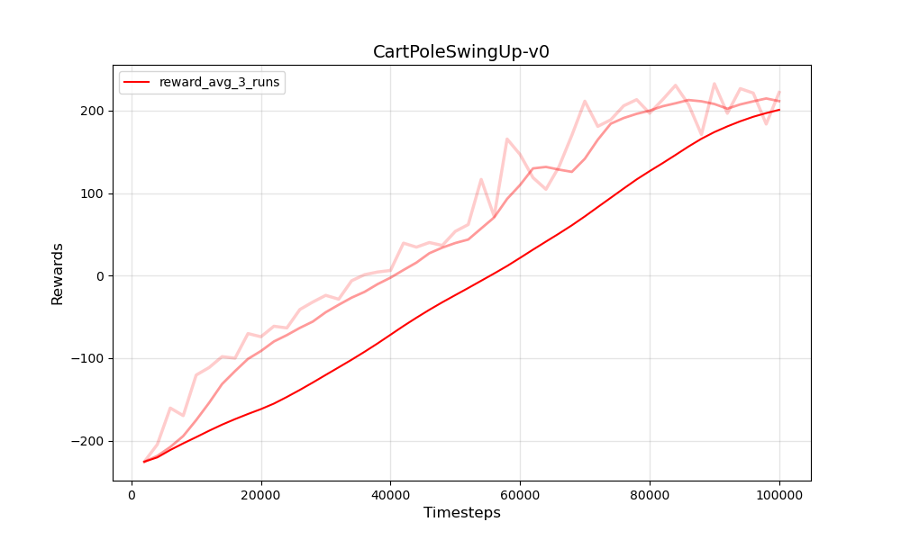
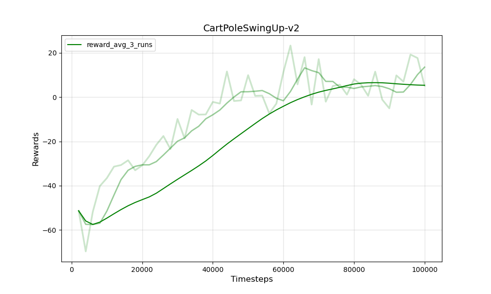

# Model-based Meta Reinforcement Learning with NeuBANP

## Installation
```bash
pip install gym
pip install gym-cartpole-swingup
```

## Configure paths
### 1. `paths.yaml`
```yaml
path1:
  datasets_path:
    "path to store dataset"
  evalsets_path:
    "path to store evaluation set"
  results_path:
    "path to store results"
```
### 2. `pretrain.py`
```python
parser.add_argument('--loc', choices=['path1'], default='path1')
```
원하는 경우 `pretrain.py` 에서 `--loc` argument 의 choices 에 여러 개의 path 를 추가할 수 있고,
해당 path 를 `paths.yaml` 에도 추가해주면 된다.
```python
if args.gpu < 0:
    args.loc = "your local path name (cpu)"
else:
    os.environ['CUDA_VISIBLE_DEVICES'] = f"{args.gpu}"
```
이 부분에 CPU 를 사용하는 경우에 명시된 path_name 을 적어주면 된다. (e.g. path1)

## Pre-train Environment Model
```bash
python pretrain.py --gpu <int> --loc <path_name>
```

## Custom Environment for applying NeuBANP
학습된 models 를 이용한 environment 를 구성하기 위해서는
`gym` 과 `gym-cartpole-swingup` packages 내부를 수정할 필요가 있다. <br>
각 package 가 저장된 경로로 가서 아래 명시한 부분을 수정하면 된다 (아래 code 를 copy & paste).
```bash
anaconda_path/envs/env_name/lib/python3.x/site-packages/gym
```
### 1. `gym/wrappers/time_limit.py`
기존 `step` method 의 argument 에 `**kwargs` 추가 
```python
class TimeLimit(gym.Wrapper):
    def __init__(self, env, max_episode_steps=None):
        super(TimeLimit, self).__init__(env)
        if max_episode_steps is None and self.env.spec is not None:
            max_episode_steps = env.spec.max_episode_steps
        if self.env.spec is not None:
            self.env.spec.max_episode_steps = max_episode_steps
        self._max_episode_steps = max_episode_steps
        self._elapsed_steps = None

    def step(self, action, **kwargs):
        assert self._elapsed_steps is not None, "Cannot call env.step() before calling reset()"
        observation, reward, done, info = self.env.step(action, **kwargs)
        self._elapsed_steps += 1
        if self._elapsed_steps >= self._max_episode_steps:
            info['TimeLimit.truncated'] = not done
            done = True
        return observation, reward, done, info

    def reset(self, **kwargs):
        self._elapsed_steps = 0
        return self.env.reset(**kwargs)
```
### 2. `gym_cartpole_swingup/__init__.py`
아래 code 를 추가
```python
register(
    id="CartPoleSwingUp-v2",
    entry_point="gym_cartpole_swingup.envs.cartpole_swingup:CartPoleSwingUpNeuBANP",
    max_episode_steps=500,
)
```
### 3. `gym_cartpole_swingup/envs/cartpole_swingup.py`
Meta-learning 을 위해 `frozen=False` 로 수정하였고,
논문의 setting 을 따라서 `forcemag=15.0` 으로 수정
```python
@dataclass(frozen=False)
class CartParams:
    """Parameters defining the Cart."""

    width: float = 1 / 3
    height: float = 1 / 6
    mass: float = 0.5


@dataclass(frozen=False)
class PoleParams:
    """Parameters defining the Pole."""

    width: float = 0.05
    length: float = 0.6
    mass: float = 0.5


@dataclass
class CartPoleSwingUpParams:  # pylint: disable=no-member,too-many-instance-attributes
    """Parameters for physics simulation."""

    gravity: float = 9.82
    # forcemag: float = 10.0
    forcemag: float = 15.0
    deltat: float = 0.01
    friction: float = 0.1
    x_threshold: float = 2.4
    cart: CartParams = field(default_factory=CartParams)
    pole: PoleParams = field(default_factory=PoleParams)
    masstotal: float = field(init=False)
    mpl: float = field(init=False)

    def __post_init__(self):
        self.masstotal = self.cart.mass + self.pole.mass
        self.mpl = self.pole.mass * self.pole.length
```
`CartPoleSwingUpV1` 아래에 밑의 code 추가
```python
import os.path as osp
import torch
import yaml

from utils.misc import load_module


class CartPoleSwingUpNeuBANP(CartPoleSwingUpV0):
    def __init__(self):
        super(CartPoleSwingUpNeuBANP, self).__init__()

        device = torch.device('cuda' if torch.cuda.is_available() else 'cpu')
        neuboots = True

        with open(f'configs/neubanp.yaml', 'r') as f:
            config = yaml.safe_load(f)

        neuboots_config = {}
        if neuboots:
            neuboots_config = {"yenc": True, "wenc": True, "wagg": 'mean', "wloss": True, 'wattn': True}

        model_cls = getattr(load_module(f"models/neubanp.py"), 'neubanp'.upper())
        model = model_cls(**config, **neuboots_config).to(device)

        with open("runner/paths.yaml") as f:
            paths = yaml.load(f, Loader=yaml.FullLoader)['local']
            datasets_path = paths["datasets_path"]
            evalsets_path = paths["evalsets_path"]
            results_path = paths["results_path"]

        expid = f'bs10'
        root = osp.join(results_path,
                        'neubanp',
                        f'{expid}_batch16_min64_max300')
        ckpt_path = osp.join(root, 'ckpt.tar')

        ckpt = torch.load(ckpt_path, map_location=device)
        model.load_state_dict(ckpt.model)

        self.model = model
        self.model.eval()
        self.device = device

    def step(self, action, batch=None, neuboots=False):
        if neuboots:
            with torch.no_grad():
                state = self.state
                # Valid action
                action = np.clip(action, self.action_space.low, self.action_space.high)

                if len(state) == 4:
                    state = self._get_obs(state)

                out = self.model.predict(
                    xc=batch.xc[:, :-1, :],
                    yc=batch.yc,
                    xt=torch.tensor(np.concatenate((state, action), axis=-1)[None, None, :],
                                    dtype=torch.float,
                                    device=self.device)
                )
                out = out.mean.squeeze().cpu().numpy()
                next_state = out[:-1]
                reward = out[-1]
                self.state = next_state

                next_obs = next_state
                done = self._terminal(next_state[0], neuboots=True)
        else:
            state = self.state
            # Valid action
            action = np.clip(action, self.action_space.low, self.action_space.high)
            self.state = next_state = self._transition_fn(self.state, action)
            next_obs = self._get_obs(next_state)
            reward = self._reward_fn(state, action, next_state)
            done = self._terminal(next_state)

        return next_obs, reward, done, {}

    def _terminal(self, state, neuboots=False):
        if neuboots:
            return bool(abs(state) > self.params.x_threshold)
        else:
            return bool(abs(state.x_pos) > self.params.x_threshold)
```

## Environment Model Evaluation
학습된 model 이 실제 environment 와 얼마나 비슷한 rollout 을 결과로 내는지 확인
### 1. Environment rollouts
`cartpole.py` 내부에 `neuboots=False` 로 수정
### 2. Model rollouts
`cartpole.py` 내부에 `neuboots=True` 로 수정
```bash
python cartpole.py
```
### 3. Plot rollouts
```bash
python rollout_plot.py
```

 <br>
 <br>
 <br>
 <br>

## Training RL agent (PPO)
### 1. Train `train.py`
실제 environment 를 사용해서 training 하는 경우에는,
```python
env_name = "CartPoleSwingUp-v0"
```
model 을 사용해서 training 하는 경우에는,
```python
env_name = "CartPoleSwingUp-v2"
```
```bash
python train.py
```
### 2. Plot results `plot_graph.py`
```python
env_name = "CartPoleSwingUp-v0" or "CartPoleSwingUp-v2"
```
```bash
python plot_graph.py
```
* Environment
 <br>
* NeuBANP
 <br>
